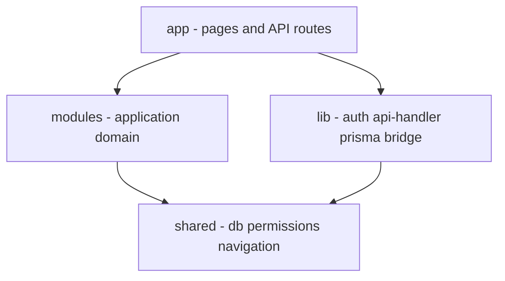

# Architecture

แผนที่สถาปัตยกรรม — **รายละเอียดอยู่ในเอกสารย่อย** ไม่ซ้ำที่นี่

ระบบเป็น **modular monolith** (Next.js App Router + `modules/` + `shared/`)

## เอกสารใน `docs/architecture/`

| เอกสาร | ใช้เมื่อ |
|--------|---------|
| [vision-as-is-to-be.md](./architecture/vision-as-is-to-be.md) | ขอบเขต as-is / to-be ของโมดูล |
| [modular-folder-blueprint.md](./architecture/modular-folder-blueprint.md) | โครงโฟลเดอร์ + เฟสย้ายโค้ด |
| [core-platform-convention.md](./architecture/core-platform-convention.md) | Auth, RBAC, shared rules, กฎ import |
| [contributing-modules.md](./architecture/contributing-modules.md) | วิธีเพิ่มโมดูลและ use-case |
| [db-blueprint.md](./architecture/db-blueprint.md) | กลุ่มตาราง / normalization (ดู [DATABASE.md](./DATABASE.md) ด้วย) |
| [rollout-runbook.md](./architecture/rollout-runbook.md) | Rollout / rollback + smoke |

## จุดเข้าโค้ดสำคัญ

| เรื่อง | ที่อยู่ |
|--------|---------|
| Navigation / เมนู | `shared/navigation/moduleRegistry.ts` |
| Permissions | `lib/permissions.ts` → `shared/permissions` |
| Prisma client | `shared/db` / `lib/prisma.ts` |
| Auth | `lib/auth.ts`, `lib/auth.config.ts`, `middleware.ts` |
| Module READMEs | `modules/*/README.md` |

## เอกสารที่เกี่ยวข้อง

- [API.md](./API.md) — convention และกลุ่ม endpoint
- [SECURITY.md](./SECURITY.md)
- [ops/DEPLOYMENT.md](./ops/DEPLOYMENT.md)
