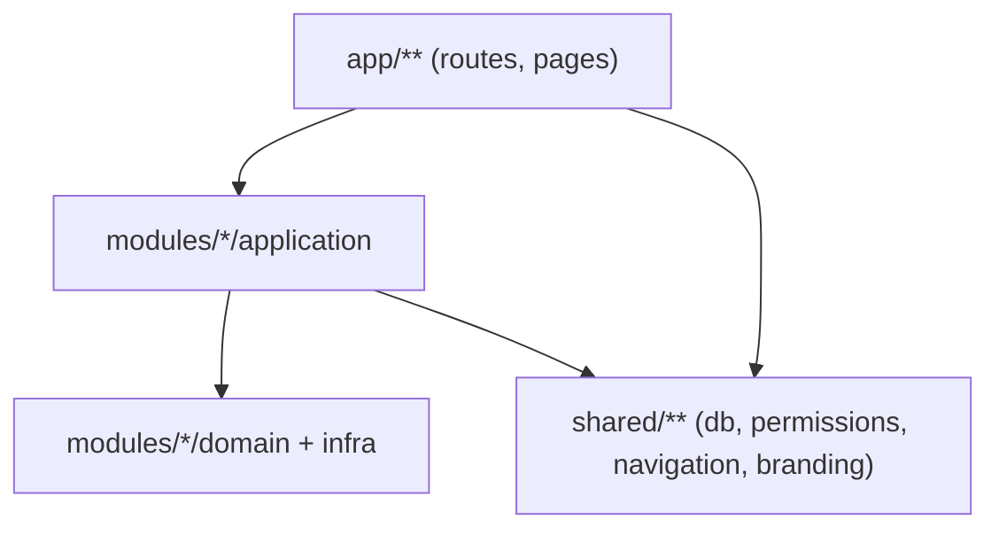

# Core Platform Convention

เอกสารนี้นิยาม **Core Platform** เป็น *convention* (กฎ + mapping) ไม่ใช่โฟลเดอร์ใหม่ — ระบบยังเป็น Modular Monolith ตาม [modular-folder-blueprint.md](./modular-folder-blueprint.md) แต่ layer ที่ทุกโมดูล "ธุรกิจ" (maintenance, transport, hr, inventory, …) ใช้ร่วมกันต้องมีที่อยู่ชัดเจนและกฎ import เดียวกัน

## 1) Core layers ปัจจุบัน (as-is)

| ชั้น | ที่อยู่ | หน้าที่ |
|-----|--------|--------|
| Auth / Session | [`lib/auth.ts`](../../lib/auth.ts), [`lib/auth.config.ts`](../../lib/auth.config.ts), `middleware.ts` | login, session, edge-safe middleware boundary |
| Identity (Users) | [`modules/iam`](../../modules/iam) | users CRUD, session boundary |
| Authorization (RBAC) | [`lib/permissions.ts`](../../lib/permissions.ts) → re-export `shared/permissions` | `hasPermission`, `Resource`/`Action`, per-branch role |
| Tenant / Org | [`modules/settings`](../../modules/settings) | branches, roles, master-data ที่เป็น settings |
| Notifications | [`modules/notifications`](../../modules/notifications) | in-app alerts, cron generator |
| Branding | [`shared/branding.ts`](../../shared/branding.ts) | ชื่อระบบ, tagline, launcher badge |
| Navigation | `shared/navigation/**` | module registry, nav tree, `/apps` launcher, command palette |
| DB access | [`shared/db`](../../shared/db) → [`lib/prisma.ts`](../../lib/prisma.ts) | Prisma client singleton |
| API error handling | [`lib/errors.ts`](../../lib/errors.ts), [`lib/api-handler.ts`](../../lib/api-handler.ts) | `AppError` subclasses + `withAuth` wrapper |

Core ไม่ใช่โมดูลเดียว — เป็น **cross-cutting layer** ที่กระจายอยู่ใน `lib/` และ `shared/` และถูกเรียกจากทุกโมดูลธุรกิจ

## 2) กฎ import (บังคับ)

- `app/**` → เรียก `modules/*/application` หรือ `shared/*` เท่านั้น — **ห้าม** import `@/lib/prisma` ตรงใน `app/api/**/route.ts` (ยกเว้นกรณีที่อนุมัติไว้ชัดในหัวข้อ 4)
- `modules/*/application` → เรียก `domain` + `infra` ของโมดูลตัวเอง และ `shared/*`
- **ห้าม** `modules/A` query ตาราง domain ของ `modules/B` ตรง — ถ้าต้องใช้ข้อมูลข้ามโมดูล ให้เรียกผ่าน application service ของโมดูลปลายทาง
- Error handling: throw `AppError` subclass (`ForbiddenError`, `NotFoundError`, `ValidationError`, `UnauthorizedError`) จาก application service แล้วให้ `withAuth` (หรือ route's try/catch) แปลงเป็น `NextResponse`/`Response.json`

## 3) Out of scope (ยังไม่ทำ)

Core Platform convention นี้ **ไม่รวม**:

- **Files platform** — ยังไม่มี attachment กลาง; แต่ละโดเมนจัดการไฟล์ของตัวเอง (เช่น รูปเครื่องจักร, แนบใบงานขนส่ง) จนกว่าจะมี use case ร่วม 2–3 โมดูลจริง
- **Workflow engine** — ยังไม่มี state machine กลาง; แต่ละโมดูลจัดการ status transition ของตัวเอง (เช่น `TransportJobStatus`)
- **Procurement / Finance / Production / AI modules** — รอ business requirement ชัดก่อนเริ่ม

## 4) Route ที่ได้รับการยกเว้น (import prisma ตรงได้)

| Route | เหตุผล |
|-------|--------|
| `app/api/auth/[...nextauth]/route.ts` | NextAuth adapter ต้องผูก Prisma adapter ตรง |
| `app/api/cron/**` | Cron job เรียก service เดียวกันแต่บางส่วนอาจต้อง query ข้าม scope สำหรับ batch job — ตรวจทีละไฟล์ก่อนเพิ่มเข้า allowlist |

รายการนี้อัปเดตพร้อมกับ ESLint `no-restricted-imports` override (ดู [modular-folder-blueprint.md](./modular-folder-blueprint.md) หัวข้อ import boundaries)

## 5) เมื่อจะเพิ่ม Core capability ใหม่

ก่อนสร้างโฟลเดอร์ `core/` หรือ platform ใหม่ ให้ตรวจสอบ:

1. มีโมดูลธุรกิจ **อย่างน้อย 2–3 โมดูล** ที่ต้องการ capability นี้จริงหรือไม่
2. ทำเป็น `shared/*` helper หรือ `modules/<capability>/application` ได้ไหมก่อนแยก platform
3. ถ้าจำเป็นต้องมี state/DB ของตัวเอง (เช่น Files, Workflow) — เขียน DB blueprint ตาม [db-blueprint.md](./db-blueprint.md) ก่อน migrate

## อ้างอิง

- [modular-folder-blueprint.md](./modular-folder-blueprint.md) — โครงสร้างโฟลเดอร์ + สถานะ implementation
- [contributing-modules.md](./contributing-modules.md) — ขั้นตอนเพิ่มโมดูล/use-case
- [db-blueprint.md](./db-blueprint.md) — ตาราง + migration DB
