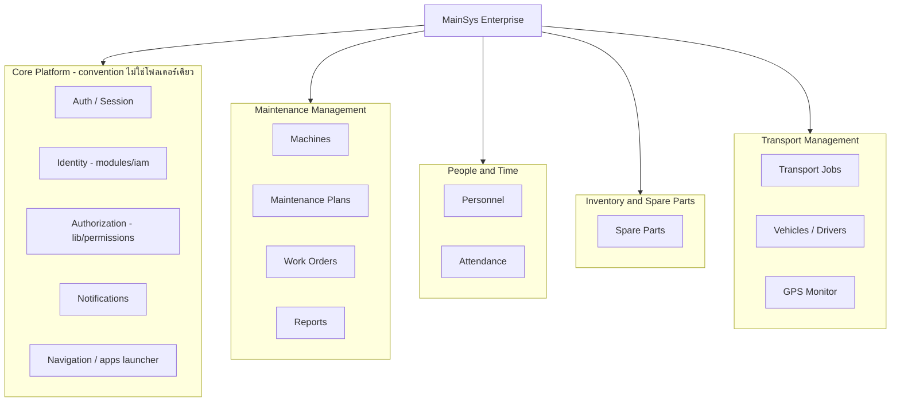
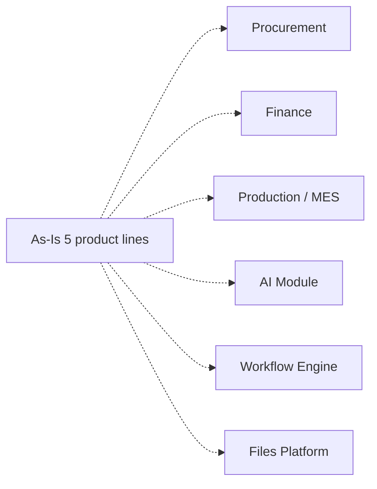

# MainSys Enterprise — As-Is vs To-Be

เอกสารนี้เทียบ **สถานะจริงของระบบ (As-Is)** กับ **วิสัยทัศน์ระยะยาว (To-Be)** เพื่อไม่ให้สับสนระหว่าง "สิ่งที่ build แล้ว" กับ "ทิศทางในอนาคต" — ดูรายละเอียดการดำเนินการเชิงเทคนิคที่ [modular-folder-blueprint.md](./modular-folder-blueprint.md) และ [core-platform-convention.md](./core-platform-convention.md)

## As-Is (สถานะปัจจุบัน)

| Product line (`/apps`) | สถานะ | หมายเหตุ |
|------------------------|--------|---------|
| การจัดการซ่อมบำรุง (`maintenance_mgmt`) | เต็มรูปแบบ | Dashboard, PM plans, schedules, work orders, reports, machines |
| บุคลากรและเวลา (`people_time`) | เต็มรูปแบบ | `modules/hr` — personnel + attendance + นำเข้า Excel |
| คลังสินค้าและอะไหล่ (`inventory_spares`) | บางส่วน | เน้น spare parts; ยังไม่มีคลังสินค้าทั่วไป/PO |
| บริหารงานขนส่ง (`transport_ops`) | เต็มรูปแบบ | `modules/transport` — jobs, vehicles, drivers, calendar, GPS monitor |
| ตั้งค่าและผู้ดูแลระบบ / Core Platform (`settings_admin`) | เต็มรูปแบบ | users, branches, roles, master-data — เป็นชั้น Core convention ที่ทุกสายงานพึ่งพา |

**Core Platform ปัจจุบันเป็น convention ไม่ใช่โฟลเดอร์เดียว** — กระจายอยู่ใน `lib/auth.ts`, `modules/iam`, `lib/permissions.ts`, `modules/notifications`, `shared/navigation/**`, `shared/branding.ts` ดูรายละเอียดที่ [core-platform-convention.md](./core-platform-convention.md)

## To-Be (วิสัยทัศน์ — ยังไม่ implement)

| Vision item | สถานะ | เงื่อนไขก่อนเริ่ม |
|-------------|--------|-------------------|
| Procurement | ยังไม่ทำ | ต้องมี PO/ซัพพลายเออร์ flow ที่ธุรกิจใช้จริง (ตอนนี้มี `Supplier` model บางส่วนใน inventory) |
| Finance | ยังไม่ทำ | รอ requirement บัญชี/ผูก accounting ให้ชัดก่อน — มักทำหลังโมดูลอื่นนิ่ง |
| Production / MES | ยังไม่ทำ | ระบบนี้เป็น maintenance-centric ไม่ใช่ MES — ต้องมี use case การผลิตจริงก่อนเริ่ม |
| AI Module | ยังไม่ทำ | รอ process ที่ซ้ำและวัด ROI ได้ชัดก่อนลงทุน |
| Workflow Engine กลาง | ยังไม่ทำ | แต่ละโมดูลจัดการ state ของตัวเอง (เช่น `TransportJobStatus`) จนกว่าจะมี flow ข้ามโมดูลที่ซ้ำจริง 2–3 กรณี |
| Files Platform กลาง | ยังไม่ทำ | แต่ละโดเมนจัดการไฟล์ของตัวเอง (รูปเครื่องจักร, แนบใบงานขนส่ง) จนกว่าจะมี use case ร่วมจริง |

## กฎการตัดสินใจ

- **อย่าสร้างโมดูลใหม่ล่วงหน้า** ตามรายชื่อใน To-Be — เริ่มเมื่อมี user story ใช้งานจริงทุกสัปดาห์ + ข้อมูล master ครบพอสร้าง flow แรกได้
- **ทุกโมดูลใหม่เดินตาม playbook เดียวกัน** — ดู [contributing-modules.md](./contributing-modules.md): route คงเดิม → application service → registry → RBAC
- **Core Platform ขยายแบบ convention ก่อน** — ทำเป็น `shared/*` helper หรือ `modules/<capability>/application` ก่อนแยก platform ใหม่ (ดูเงื่อนไขใน [core-platform-convention.md](./core-platform-convention.md#5-เมื่อจะเพิ่ม-core-capability-ใหม่))

## อ้างอิง

- [modular-folder-blueprint.md](./modular-folder-blueprint.md) — โครงสร้างโฟลเดอร์ + สถานะ implementation
- [core-platform-convention.md](./core-platform-convention.md) — core layers + กฎ import
- [contributing-modules.md](./contributing-modules.md) — ขั้นตอนเพิ่มโมดูล/use-case
